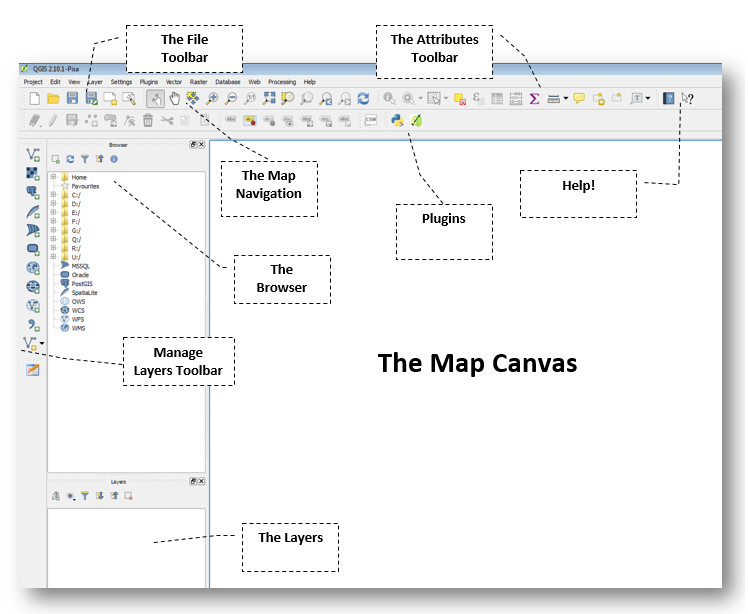
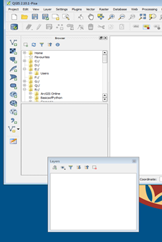
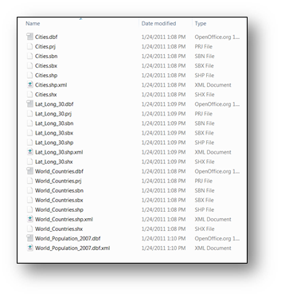
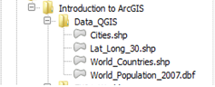

<!-- TOC depthFrom:1 depthTo:3 withLinks:1 updateOnSave:1 orderedList:0 -->

- [Introduction to GIS with QGIS](#introduction-to-gis-with-qgis)
	- [GIS Resources](#gis-resources)
	- [Download Tutorial Data](#download-tutorial-data)
	- [Open QGIS and Explore the User Interface](#open-qgis-and-explore-the-user-interface)
		- [The Basic Components of the QGIS Interface](#the-basic-components-of-the-qgis-interface)
		- [Interacting with Tabbed Windows](#interacting-with-tabbed-windows)
		- [Explore the Browser](#explore-the-browser)
	- [Finally, let’s open a Map Document!](#finally-lets-open-a-map-document)
		- [But Wait!](#but-wait)
		- [The Layers Tabbed window and its Properties](#the-layers-tabbed-window-and-its-properties)
		- [Change the project Coordinate System.](#change-the-project-coordinate-system)
		- [Change the Layer Coordinate System.](#change-the-layer-coordinate-system)
	- [Explore Navigations Tools and Visibility in Data Frames](#explore-navigations-tools-and-visibility-in-data-frames)
		- [Zoom to Layer](#zoom-to-layer)
		- [Bookmarks](#bookmarks)
		- [Display Order](#display-order)
	- [Working with Layers & Their Properties](#working-with-layers-their-properties)
		- [Layer Visibility](#layer-visibility)
		- [Examining and Selecting by Attributes](#examining-and-selecting-by-attributes)
		- [Exporting Data](#exporting-data)
		- [Definition Queries](#definition-queries)
		- [Join a Table to a Layer](#join-a-table-to-a-layer)
	- [Print Composer](#print-composer)
		- [Adding Map Elements](#adding-map-elements)
- [Exporting Your Map](#exporting-your-map)

<!-- /TOC -->

# Introduction to GIS with QGIS

Stacey Maples – Geospatial Manager – Stanford Geospatial Center –
[stacemaples@stanford.edu](mailto:stacemaples@stanford.edu)

David Medeiros – GIS Instruction & Support Specialist - Stanford
Geospatial Center - [davidmed@stanford.edu](mailto:davidmed@stanford.edu)

This introductory session will focus upon the fundamental concepts and
skills needed to begin using Geographic Information Systems software for
the exploration and analysis of spatial data using the ArcGIS platform. 
Topics will include:

-   What is GIS?
-   Spatial Data Models and Formats
-   Projections and Coordinate Systems
-   Basic Data Management
-   The ArcMap User Interface
-   Simple Analysis using Visualization.

## GIS Resources

Stanford Geospatial Center website - [http://gis.stanford.edu/](http://gis.stanford.edu/)

Stanford GIS Listserv -
[https://mailman.stanford.edu/mailman/listinfo/stanfordgis](https://mailman.stanford.edu/mailman/listinfo/stanfordgis)

QGIS 2.8 Help - [http://docs.qgis.org/2.8/en/docs/user_manual/](http://docs.qgis.org/2.8/en/docs/user_manual/)

## Download Tutorial Data

1.  In a browser, go to [https://stanford.box.com/SGCIntroGIS](https://stanford.box.com/SGCIntroGIS) and click
    on the drop-down arrow to the right of each folder to download
    individual datasets. Save the Dataset to your Desktop.

2.  Right-click on the resulting **\*.zip** file and select Extract All…

3.  Accept all defaults to extract the data file.

## Open QGIS and Explore the User Interface

QGIS (Quantum GIS) is a freen and open – source desktop geographic
information system (GIS) applocation. The first thing we want to do is
**Open** QGIS and get familiar with the Default User Interface.

1.  In Windows, go to the Programs menu and find the QGIS Pisa, then
    select QGIS Desktop 2.10.1

2.  You should be presented with the **New Document**. You should then
    be presented with something like the interface you see below:

	

### The Basic Components of the QGIS Interface

The QGIS interface is made up of three basic components:

**The Map Canvas** – This is where the raster and vector layers are
displayed.

**Tabbed Windows**:

-   **The Browser Window –** Functions much as Explorer does in Windows.
    In this window, you can visualize your drives and folders. Is the
    equivalent of ArcCatalog in ArcMap.

-   **The Layers Window** – This is where your added geographic and
    non-geographic datasets will show. This is similar to the Table of
    Contents in ArcMap.

**General Menu Bars:**

-   **File Bar –** Has the basic commands of any file: New, Open, Save,
    Save As. The New Print Composer and Composer Manager are to create
    and manage layout views.

-   **Map Navigation –** Allows the user to Pan, Zoom to a Selected
    Feature, Zoom In, Zoom Out, Zoom to previous/next extent, and
    Refresh.

-   **Attributes –** These tools allow the user to: Identify attributes,
    Select / Deselect features, Opens attribute table, measure
    distance/areas/angles, create spatial bookmarks.

-   **Plugins –** QGIS comes with two default plugins: Python Console
    and QGis 2 Leaflet Webmap.

-   **Help –** The question mark booklet is linked to the QGIS User
    Guide.

-   **Manage Layers –** This bar is to add layers (vector, raster, new
    shapefile layer)

### Interacting with Tabbed Windows

1.  Move your cursor over the **Browser** dotted line. Click on the
    dotted line and drag the window to the bottom, below the **Layers**
    tabbed window.

	

### Explore the Browser

1.  		Using the **Window Explorer**, browse
    to the **\\Introduction to ArcGIS\\EX01\_World folder**, where you
    extracted the EX01\_World.zip file and browse into the
    **EX01\_World\\Data** Folder.

	

Note that, while there are 23 files in this folder, there are actually
only 3 Shapefiles and a CSV Table here, as far as QGIS is concerned.
This is because a Shapefile isn’t really a *file* but a collection of
files. *You* are looking at this folder in Windows Explorer in order to
illustrate a very important point about many types of geographic data
formats: Geographic datasets are often not easily manageable using
software not specifically designed for handling GIS data. In the case of
the Shapefile, for example, if you wish to rename or move a shapefile,
you must move or rename ALL of its component files in exactly the same
way, or you can corrupt the shapefile.

2.  **Return to QGIS** and use the **Browser Tabbed Window** to expand
    the Home Folder.

3.  **Expand** the **Home** and **Desktop** folder.

4.  **Expand** the **Introduction to ArcGIS**, and then **expand** the
    **Workshop Data Folder**.

Note that the Shapefile is much simplified
in the Browser Window. Although the Shapefile is still made up of
several files, QGIS seems to know that it’s not a good idea to make you
deal with all that, so it simplifies things by only showing you the .shp
file.

## Finally, let’s open a Map Document!

{width="0.23194444444444445in"
height="0.25555555555555554in"}You should, in addition to a Data Folder
full of shapefiles, have a Map Document in your **\\Introduction to
ArcGIS\\EX01\_World \\EX01\_World Folder** called… EX01\_World.qgs. The
icon looks like this:

1.  **Drag** the **EX01\_World Map Document** into the **Map Canvas** to
    open it.

### But Wait!

Has something gone awry? Do you see something that looks like this?

{width="3.8368055555555554in"
height="2.545138888888889in"}You are experiencing the dreaded
“**Absolute Paths**” problem, endemic to GIS Softwares. To fix this
issue, do the following:

1.  **Press shift and click** to select all the layers.

2.  **Click the Browse** and look for the **Data\_QGIS** of the tutorial
    dataset and **select the folder**. Click OK.

{width="2.6347222222222224in"
height="2.0319444444444446in"}You should find that (because they are all
in the same ‘**workspace’**) all of your layers have been repaired and
you should see something like the image on the right.

{width="1.6604166666666667in"
height="1.9645833333333333in"}

### The Layers Tabbed window and its Properties

Now take a look at the **Layers Tabbed Window**. You should 3 Layers
corresponding to the shapefiles in your Data Folder.

What you don’t see is that **CSV Table**. **Look** for the
**World\_Population\_2007** on the **Browser Window**, select it and
drag it to the **Layers Window. **

Note that the **World\_Population\_2007** table has been added to the
Layers.

Notice how Asia almost disappears. **Right-Click** on the Lat\_Long\_30
shapefile. Select **Properties** and go to the **General Tab.** Under
*Coordinate Reference System* (CRS) notice that the selected CRS is WGS
84**.** If you click on it, you will see that the Project CRS is
World\_Azimuthal Equidistant. This projection is useful for showing
correct airline distances. So the layers in this document are displayed
using World Azimuthal Distance.

{width="4.123039151356081in"
height="1.3840004374453194in"}

### Change the project Coordinate System.

1.  {width="2.482638888888889in"
    height="1.167361111111111in"}Close the **Layer Properties** and go
    to the **Project Tab** (Pull-down menu) and select **Project
    Properties…**

2.  **Click** on the **CRS Tab**. **Filter and Select** “EPSG:4326 (WGS
    84)”

3.  **Click** OK

4.  **Click Save **

What you have just done is reassigned the coordinate system of the **Map
Canvas** to that of the **Layers** in your **Map Document**. This (**GCS
WGS 1984**) is actually the coordinate system of all of the layers in
your **Map Document**, so you should experience an increase in drawing
performance, since **QGIS** is no longer projecting these layers
on-the-fly to the **World Azimuthal Equidistant projection** (which was
chosen for its extremity, in this case). The result of this change
should be a fairly substantial change to the view on the Map Canvas.

{width="5.461687445319335in"
height="2.4240004374453195in"}

### Change the Layer Coordinate System.

Where are the cities?

1.  **Right Click** on the Cities Layer and **Zoom to Layer.** Notice
    how the cities are displayed.

2.  **Right click** on the Cities Layer and select **Layer Properties.**
    Notice how the coordinate system is not WGS. Change the coordinate
    system to **“**Project CRS EPSG:4326 (WGS 84)”

3.  **Click** OK

4.  **Click Save **

## Explore Navigations Tools and Visibility in Data Frames

Before we begin to explore the properties of individual layer in the Map
Document, we will first spend some time getting familiar with the
navigation tools in ArcMap. Most of these tools can be found on the
“Tools” toolbar, though some of the more useful ones involve right-click
context menus of the layers.

### Zoom to Layer

1.  **Right-click** on the **Lat\_Lon\_30 Layer**, in the **Layers
    Window**, and select **Zoom to Layer**.

Note that this should present you with the entirety of the Lat\_Lon\_30
Layer’s extent.

#### Map Navigation Toolbar

{width="4.135416666666667in"
height="0.41597222222222224in"}The **Map Navigation Toolbar** provides
the bulk of the tools for navigation in the **Map Canvas**. Most of them
are fairly obvious. Take a moment to explore each of these tools, and
how it works.

1.  {width="0.23880577427821523in"
    height="0.23880577427821523in"}The **Touch Zoom and Pan** - Works if
    you have a notebook with touch screen. Zoom in and zoom out using
    double finger touch.

2.  {width="0.2561275153105862in"
    height="0.24in"}The **Pan Map** changes the Extent of Map Canvas,
    without changing the scale. Click on the Pan Tool and use it to move
    around the Map Canvas.

3.  {width="0.27428477690288716in"
    height="0.24in"}The **Pan Map to Selection** changes the Extent of
    your Map Canvas to the feature being selected, without changing the
    scale

4.  {width="0.27200021872265967in"
    height="0.24in"}The **Zoom In Tool** and
    {width="0.2537314085739283in"
    height="0.2368788276465442in"}**Zoom Out** works exactly as you
    would expect. Click on the Zoom Tool, and drag a box to enclose the
    Continental United States. You can also single-click with this tool
    to use it as a Fixed Zoom Tools.

5.  {width="0.2537314085739283in"
    height="0.2291765091863517in"} The **Zoom Full** zooms you to the
    full extent of the layer in your Map Project with the largest
    spatial extent. This can sometimes be problematic if you are working
    at a local level, but using one or more layers that are global in
    extent (for example, many of the network base map services).

6.  {width="0.21592082239720034in"
    height="0.21641732283464568in"}The **Zoom to Selection** changes the
    Extent of your Map Canvas and zooms in or out to the selected
    feature.

    When zooming in or out, the Scale Values at the bottom page change.
    Remember that the bigger the number (1:60,000,000), the larger the
    area being displayed. Although 60,000,000 is bigger than 60, a scale
    1:60,000,000 is a small scale and 1:60 is a large scale because the
    division of 1/60,000,000 is smaller than 1/60.

    {width="4.208333333333333in"
    height="0.2965277777777778in"}{width="1.6715277777777777in"
    height="1.0590277777777777in"}

7.  {width="0.21641841644794402in"
    height="0.21641732283464568in"}The **Zoom to Layer** to a specific
    layer extent.

8.  {width="0.21641841644794402in"
    height="0.21641732283464568in"}The **Zoom Last** and
    {width="0.2089555993000875in"
    height="0.21641732283464568in"} **Zoom Next** works as a Redo or
    Undo tool **ONLY** for the Scale/Extent in your Map Canvas. This
    tool is particularly useful if you change your Map Extent
    inadvertently.

9.  {width="0.23134405074365705in"
    height="0.21641841644794402in"} The **Refresh Button** will reload
    your Map Extent

### Bookmarks

One of the most useful navigation tools is the ability to create
**spatial Bookmarks**.

1.  {width="2.0180555555555557in"
    height="1.163888888888889in"}**Right Click** on any grey area and
    select **Spatial Bookmarks.**

2.  Using the **Zoom Tools** on the **Tools Toolbar**, **Zoom** your
    **Data Frame** view to the **European/Asian Landmass**.

3.  {width="0.24583333333333332in"
    height="0.22083333333333333in"}Go to the Spatial Bookmark Tabbed
    Window and **Click on Add Bookmark** and name it **Europe & Asia**

4.  {width="1.7152777777777777in"
    height="0.7013888888888888in"}**Click** on the **Zoom Full
    button**{width="0.2537314085739283in"
    height="0.2291765091863517in"}.

5.  **Go** to your **Spatial Bookmark** Window. **Select** “Europe &
    Asia” and **click** the **Zoom to bookmark**. You can also zoom to a
    bookmark by double- clicking on it.

    .

Bookmarks can even be easily shared or moved from one using the
Import/Export tool Bookmarks, too. The bookmarks are saved as xml files
that can be imported into other QGIS projects. Bookmarks can also be
deleted or edited on its name or coordinates.

### Display Order

{width="1.5666666666666667in"
height="1.3506944444444444in"}The Layer Order in the Layer Window
determines the order of display in your Map Canvas

1.  If you haven’t already, change your **Layers view, click and drag**
    the **Lat\_Lon\_30 layer** to the **top** of the **Layers Window**.
    Note that the other layers in your Map Canvas are now obscured.

## Working with Layers & Their Properties

{width="1.3354166666666667in" height="1.0486111111111112in"}

### Layer Visibility

The Table of Contents also controls Layer Visibility. You can toggle the
Layer Visibility using the checkbox next to each Layer in the Layer
Window.

1.  Use the **Visibility Checkbox** next to the **Lat\_Long\_30** Layer
    to **turn off** the **visibility** of the layer and reveal the other
    layers again.

### Examining and Selecting by Attributes

{width="3.0069444444444446in"
height="1.5743055555555556in"} The most basic method of analysis in GIS
is selection and sub-setting of data by attribute values. Now that the
Cities Layer is visible again, we can begin to address the fact that
this layer is a bit overpopulated for our purposes. Let’s say we are
interested in visualizing the global distribution of cities with
populations greater than or equal to 1 million. First we need to see if
the data necessary to do this exists in our dataset.

1.  **Right-Click** on the **Cities Layer** and select “**Open Attribute
    Table**” to open the **Attribute Table** of the layer.

2.  {width="1.8805555555555555in"
    height="1.551388888888889in"}**Click and Drag** the resulting
    **Table Window** to the **bottom** of the **Map Document** and
    expand the entire width of the Window.

3.  **Scroll** to the right until you can see the **POP, POP\_RANK** and
    **POP\_CLASS Attribute Fields**

4.  **Click** on the **POP Field Header** and select **Sort Descending**
    (Arrow Down)**.**

5.  **Scroll** down through the **Attribute table** to examine the
    relationship between these three variables.

#### Selecting By Expression

{width="3.2159722222222222in"
height="2.8465277777777778in"}What we would like to do is select all of
the cities in this dataset that have a population of 1 million or
greater. This can be accomplished using any one of these three of these
variables, but we will use the POP\_RANK variable for the sake of
simplicity.

1.  {width="0.1486111111111111in"
    height="0.1388888888888889in"}On the Upper left corner of the
    Attribute Table, **find** the **Select by Expression button** and
    **click** on it.

2.  **Expand** Fields and Values, and **Double-click** on the
    “**POP\_RANK**”

3.  {width="0.3951388888888889in"
    height="0.1798611111111111in"}**Type &lt;=** **2**

4.  **Click** the **Select button and and Close.**

5.  **Scroll** through the Attribute Table and note the records that are
    selected.

6.  You can **observe that the selection from the Attribute Table is
    also reflected in the Map Canvas. **

### Exporting Data

Notice that the Selection looks more manageable that the full dataset.
Now you will export this selection as a new shapefile, and bring it back
into QGIS as a new Layer.

1.  {width="2.761111111111111in"
    height="2.9819444444444443in"}**Right-click** on the **Cities
    Layer** and select **Save As. **

2.  **Check** Save only selected features.

3.  **Click** on the **Browse Button** and Browse into the **Data
    Folder** to save the new shapefile as **Major\_Cities.shp. **

    {width="1.5819444444444444in"
    height="0.41041666666666665in"}

4.  **Click Save** and **OK**.

5.  **Right-click** on the **original Cities Layer** and select
    **Remove**.

#### Change City Symbology

Now we have two classes of POP\_RANK to work with, and would like to
distinguish them from one another, visually.

1.  {width="2.6770833333333335in"
    height="2.2909722222222224in"}**Right-Click** on the new
    **Major\_Cities Layer** and **Open** its **Properties**

2.  **Click** on the **Style** **Tab** and **Select Categorized **

3.  On **Column,** select **POP\_CLASS **

4.  Click on **Classify**

5.  **Double click** the point symbol.

6.  In the resulting Symbol Selector, select Color Black and change Size
    to 1 for “**1,000,000 to 4,999,999**” item. Click OK

7.  {width="3.245833333333333in"
    height="1.663888888888889in"}Using the same method, change the
    symbol for the “**5,000,000 and greater**” item to Color Black with
    a size of 3 **points**.

8.  **Unchecked** the point with no value.

9.  **Click OK** to close the Layer Properties Window.

10. **Click Save**

{width="2.925in" height="1.6243055555555554in"}

#### Label Cities

{width="3.484722222222222in"
height="2.357638888888889in"}Another property of the layers in our
Document that we might want to enable is the labeling of features. This
can be accomplished, based upon an attribute value for each of the
features. In many cases, this might be the name, or some other
identifying attribute of the feature, but in some cases it might be a
quantitative value associated with the features. It is even possible to
use VB Scripting to assemble labels from several attributes and text
elements. In this example, we will label only the cities with a
POP\_RANK value of 1.

1.  **Right-Click** on the **Major\_Cities Layer** and select **Layer
    Properties**.

2.  **Click** on the **Labels Tab.**

3.  **Check** the **Label this layer with** to enable options and
    **Select** CITY\_NAME and Click **Ok.**

{width="1.8208333333333333in"
height="2.3805555555555555in"}Note that this turns on labels for all
features and. Because there are so many visible features in this layer,
this creates an unreadable labeling scheme. To remedy this, we will
limit labeling to the largest cities in the Major Cities Layer.

1.  {width="2.6486111111111112in"
    height="2.44375in"}**Right-click** on the **Major\_Cities**
    **Layer** and select **Properties**. Go to the **Labels Tab** and
    **Click** on **Rendering**.

2.  **Click** on the **Show Label** icon and **Select Edit** to open the
    Expression string builder window.

3.  **Expand** Fields and Values and **Double Click** on POP\_RANK.

4.  In the **SQL Query** window, create a **SELECT argument** as
    follows:\
    **“POP\_RANK”=1**

5.  **Click OK**

6.  **Go** to the TEXT Tab and c**hange** the **Label Size** to **7
    points** and **Click OK** to apply this labeling scheme to the Data
    Frame.

### Definition Queries

1.  **Right-click** the **World\_ Countries** **dbf** and open the
    **Attribute Table.**

> You may have noticed that many of the features in the
> World\_Population dbf file had values of **-99999** for the POP2007
> attribute. This normally indicates **NODATA** for the particular
> feature in demographic datasets. In this case, we would like to
> exclude this value from our Map Document. We could use the method used
> to subset the Cities layer earlier in the tutorial, but this time we
> will use another method called Definition Query. Definition Queries
> “define” a dataset, based upon a SQL Query, like the ones we have used
> to create the selection by attributes and the labeling class. In this
> case, the Definition Query “defines” a subset of the data layer that
> QGIS treats as the entirety of the dataset. It does not, however,
> require creating a new dataset (preventing redundancy in data storage)
> and does not alter the dataset being referenced, only our view of it
> in QGIS.

1.  **Close the World\_Countries** Attribute Table.

2.  **Right-click** the **World\_ Countries.dbf** and open the
    **Properties Window**.

3.  **Go** to the General Tab and **Click** on the **Query Builder
    button** at the bottom right**. **

4.  {width="3.0708333333333333in"
    height="2.1256944444444446in"}On the Query Builder window create an
    **Expression** as follows:\
    **"POP2007" &lt; &gt; -99999**

5.  **Click OK twice** to **apply** the **Definition Query**.

6.  {width="2.341666666666667in"
    height="2.3652777777777776in"}**Click the Refresh button.** **Open**
    the **Attribute Table** for the **World\_Countries Layer** *and
    notice how the POP2007 Field no longer contains records with -99999
    as a value**. ***

### Join a Table to a Layer

Now we will turn our attention to the World\_Countries Layer.
Ultimately, we would like to visualize the layer based upon population
density. However, the attribute table for this layer doesn’t contain
data on population. Fortunately we have a table in our Map Document with
the necessary population attribute.

1.  **Right-click** on the **World\_Population\_2007 Table** and select
    **Open**.

2.  Scroll through the attributes and note the **FIPS\_CNTRY** Attribute
    Field.

3.  **Open** the **Attribute Table** for the **World\_Countries Layer**
    and note that it also has a **FIPS\_CNTRY** Attribute Field.

> Since this attribute exists in both of these attribute tables, and its
> values are identical across the two datasets, we can use this
> attribute as the “**Key Field**” for our table join.

1.  **Close** the **Attribute Table** for the **World\_Countries
    Layer.**

2.  {width="2.526388888888889in"
    height="2.0368055555555555in"}{width="0.1486111111111111in"
    height="0.1486111111111111in"}**Right Click** on the
    **World\_Countries Layer** and **Select Properties**

3.  **Go** to the **Joins Tab** and **Click the Green Plus Sign** to
    open the **Add vector join** window.

4.  **Select** **World\_Population\_2007** as the **Join layer** and
    **FIPS\_CNTRY** for the **Join** & **Target** fields.

5.  **Click OK** to close the Window and **Apply** to create the Join.

6.  **Close** the **Layer Properties Window** and **Open** the
    **Attribute Table** for the **World\_Countries Layer** and note the
    **POP2007 Attribute (along with all other attributes from the
    World\_Population\_2007 table). **

    Some values are NULL because they were dropped

    when we perform the definition query.

#### Symbolize Countries by Population Density

We can now use the POP2007 attribute to visualize population density.
Even though the POP2007 variable is a raw counts variable, we can use
the Style Tabs Normalization capability to divide the POP2007 variable
by the area of the features to create the density value on-the-fly.

1.  {width="2.267361111111111in"
    height="1.895138888888889in"}**Open** the **Properties** for the
    **World\_Countries Layer** and click on the **Style Tab**.

2.  **Select** **Graduated** and **click** the Expression Dialog button.
    {width="0.21641732283464568in"
    height="0.16417869641294838in"}

3.  **Expand** the **Fields and Values** and **double click** on the
    fields to **write** the normalization expression:

    "World\_Population\_2007\_POP2007" / "SQMI" and **Click OK. **

4.  **Select Quantiles** as the classification mode and with **5
    Classes**.

5.  **Click OK**.

6.  **Select** a **Color Ramp** and **Click OK** to **apply** the
    **Symbology**.

7.  **Uncheck** the Lat\_Long\_30 shapefile

*Note: When selecting your color ramp, be careful about selecting
anything other than monochrome color ramps. This is because you want
your map to “read well” in grayscale. In some of the 2-3 color ramps,
the **Intensity value** of the colors at each end of the spectrum is the
same, so that they produce identical grayscale values when converted,
Xeroxed or printed in black & white.*

{width="0.27569444444444446in" height="0.22361111111111112in"}
------------------------------------------------------------------------------------

## Print Composer

1.  **Click** on **New Print Composer**

    {width="3.8465277777777778in"
    height="2.4472222222222224in"} and name it **World\_Population07.
    Click** OK.

> Note that a new window opens. Take a moment to **explore** the
> **Composer toolbar**
>
> {width="0.24596237970253718in"
> height="0.22808945756780402in"}

1.  **Click** the Add a new map icon

    and place the mouse pointer over the blank sheet. Notice a crosshair
    pointer. **Click and hold** on the left corner of the page and
    extend to the bottom right to draw a bounding box.

The Page Orientation and Size can be changed using the composition tab.

1.  {width="1.9055555555555554in"
    height="1.9770833333333333in"}**Click** on the **Map Box** to select
    the item.

2.  **Go** to the **Item Properties Tab** and expand **Position and
    Size.** Set the **Map Size** as **10 in wide by 7 in (254 by
    178 mm)**.

3.  {width="1.69375in"
    height="2.076388888888889in"}**Click** on the **Frame Tab** and set
    the **Border weight** to **.50mm points**.

4.  On the **QGIS Map Canvas**, go to **Bookmarks** and zoom to your
    **Europe & Asia** bookmark.

5.  {width="0.24583333333333332in"
    height="0.22777777777777777in"}Go to the map composer &gt; Item
    Properties &gt; Extents and **Click** View extent in map canvas. To
    pan inside the map element **click** the **Move Item content** icon
    and pan inside the map.

6.  **Check** the Background option and select a light blue as color
    background

### Adding Map Elements

{width="0.24583333333333332in" height="0.22777777777777777in"}Legend

1.  {width="0.2076388888888889in"
    height="0.21597222222222223in"}**Click the Add new legend** and draw
    a bounding box inside the map.

2.  On the Legend items **click the Filter by content** icon.

3.  Expand the Spacing Tab and set the box space to 5.0 mm.

4.  {width="1.7222222222222223in"
    height="1.8777777777777778in"}Give the **Legend** a **Border** of
    .50 mm and **Background** (white is a good choice).

5.  {width="0.24583333333333332in"
    height="0.22777777777777777in"}**Click Next&gt;** to **accept all
    remaining default settings** and insert the Legend.

6.  Use the **Select move item tool** to **reposition** the **Legend**

7.  **Go** back to the Map Document and **Open** the layer properties.
    **Rename the layer** **Major\_Cities to** “**Major Cities**”
    removing the underscore, and **click Ok** to commit the change.

8.  **Go** to the map composer and click the **Refresh** button.

> *Note that the change you have made to the name of the Layer is also
> reflected in the Legend*.

1.  Make changes to the other Text Elements of your Layers so that your
    Legend contains properly formatted and reasonable text descriptions
    and labels.

{width="0.24583333333333332in" height="0.22777777777777777in"}Scale Bar

1.  **Click** the Add new bar scale tool

2.  On the Item properties change the **Style** to Line Ticks Up.

3.  Change the Units to Feet.

4.  Set the **Segments** left 0 and right 2

5.  Use the **Select Elements Tool** to **resize** and **reposition**
    the **Scale Bar**.

{width="0.24583333333333332in" height="0.22777777777777777in"}Neat Line

1.  **Click** the Add figure and **select** add a rectangle.

2.  Be sure to draw it around all elements.

3.  Go to its Item properties and change the style to transparent fill
    and border width 0.50.

4.  **Click OK** to add the **neatline**.

# Exporting Your Map

1.  {width="0.24583333333333332in"
    height="0.22777777777777777in"}**Save your Map Composer**.

2.  **Click** on the **Export as Image Button.**

3.  **Save as type** to **PNG(\*.png)** and name it **EX01\_World**

4.  **Click Save**.

5.  **Browse** to the Workshop Folder and double click on the
    **EX01\_World.png** file to view it in the default image viewer.

{width="4.940277777777778in"
height="3.817361111111111in"}
